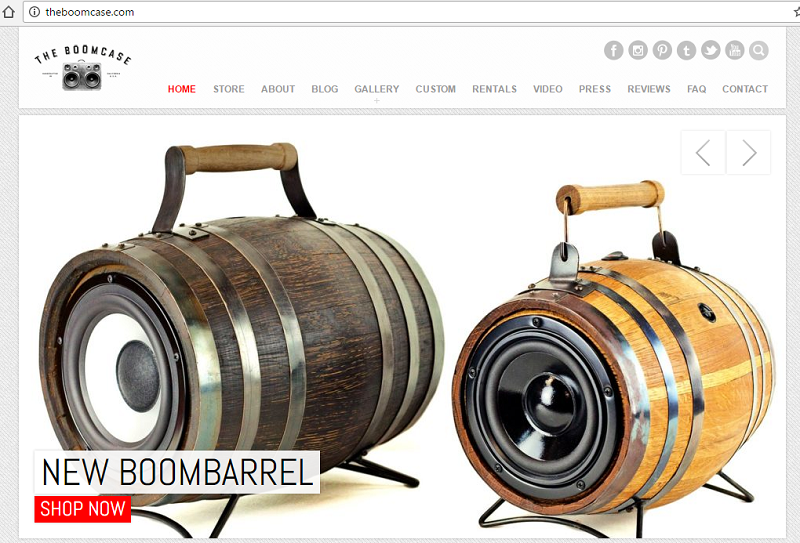
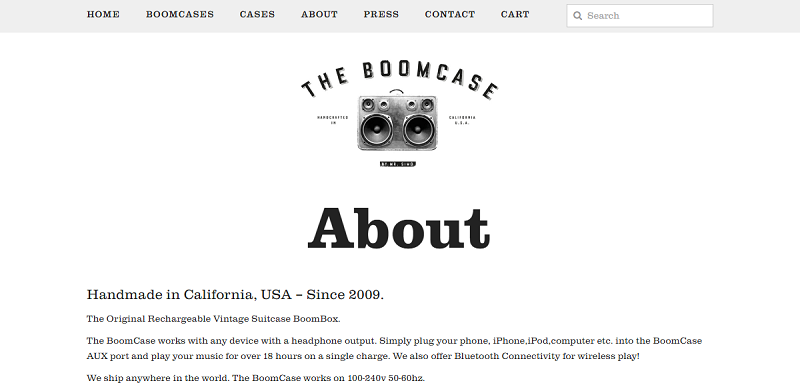
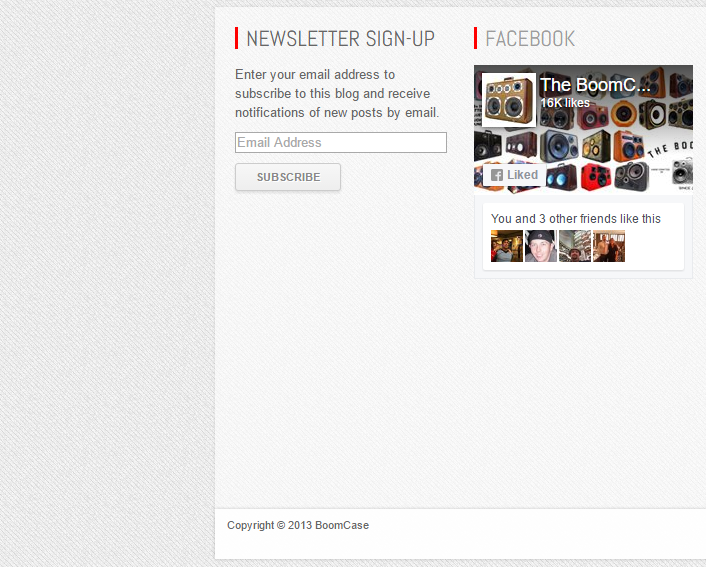
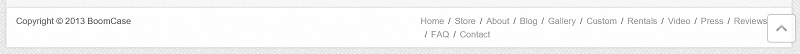
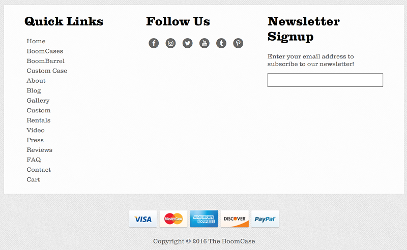
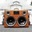
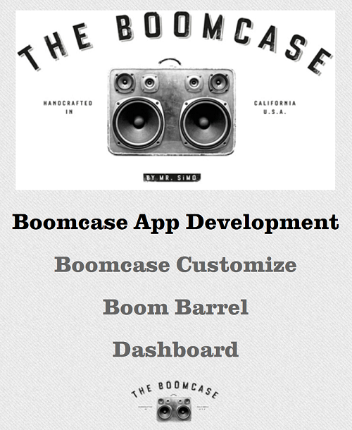

---------- ---------- ---------- ---------- ----------

Project Notes
=============

Notes about the BoomCase project.

* **2016-11-06 - Sunday**
* **2016-09-11 - Sunday**

---------- ---------- ---------- ---------- ----------

2016-11-06 - Sunday
-------------------

From initial September 11th overview email, the end of this October is the first deployment of the BoomCase applications in a state that they can be examined and looked at for discussion moving forward.

One overall issue is that currently there are two differing website designs for BoomCase, and the points to address below are regarding the differences and which to choose:

* **Overview:** Two current website designs: <http://theboomcase.com> vs <http://store.theboomcase.com>
* **Background:** Currently different, and graphically on only one design. Utilization questions moving forward
* **Links:** Currently different, and which to use in header and footer
* **Fonts:** Currently different, and question of which to use to unify project 
* **Footer Design:** Currently different, and example of a unified design
* **Favicon:** Currently different, and my suggestion of which to choose

In addition, I want to overview a few graphics that need to be updated and notes on the background video:

* **Featured In Transparancy:** Transparancy on "featured in" graphic
* **Logo Transparancy:** Transparancy on logo graphic
* **Background Video:** Notes on looping background video

### Overview

Two current website designs: <http://theboomcase.com> vs <http://store.theboomcase.com>

**theboomcase.com**

**store.theboomcase.com**

I've tried to merge the two looks together as well as include a responsive design for the app look and feel to match.

Main issue is that since both the current sites are different looks, the apps can not match both.

### Background

Currently different, and graphically on only one design. Utilization questions moving forward

**theboomcase.com background has texture vs pure white store.theboomcase.com**

As the textured version is unique I've utilized it so far for the app design:
<https://pmd-boomcase.appspot.com/>
<http://boomcase.productionmediadesign.com/>

### Links

Currently different, and which to use in header and footer

**theboomcase.com links in header**
* Home
* Store
* About
* Blog
* Gallery
* Custom
* Rentals
* Video
* Press
* Reviews
* FAQ
* Contact

**store.theboomcase.com links in header**
* Home
* Boomcases
* Cases
* About
* Press
* Contact
* Cart 

**theboomcase.com links in footer**
* Home
* Store
* About
* Blog
* Gallery
* Custom
* Rentals
* Video
* Press
* Reviews
* FAQ
* Contact

**store.theboomcase.com links in footer**
* Shipping Info - FAQ 
* All BoomCases 
* All Cases 
* Custom Order Process 
* Video 
* Retail Stores 
* Contact 
* Rentals 
* TheBoomCase.com 

To try and bring things together I've so far made a version here:
<https://pmd-boomcase.appspot.com/>
<http://boomcase.productionmediadesign.com/>

### Fonts

Currently different, and question of which to use to unify project 

theboomcase.com font used is Abel:
<http://fonts.googleapis.com/css?family=Abel>

store.theboomcase.com font used is Clarendon:
"Clarendon-Medium", "Clarendon-Light", "Clarendon-Xbold"

As Clarendon is a pay font that is already rolled out, currently I'm utilizing that one in the app:
<https://pmd-boomcase.appspot.com/>
<http://boomcase.productionmediadesign.com/>

### Footer Design

Currently different, and example of a unified design

**theboomcase.com**

**store.theboomcase.com**

**unified possibility**

### Favicon

Currently different, and my suggestion of which to choose

**theboomcase.com**

**store.theboomcase.com**

Currently the red icon stands out much more and either choice would be best to roll out to all web properties.

### Transparancy on "featured in" graphic

There are a few flaws in the transparancy of the "featured in" graphic that makes it not work with video backgrounds as well as static image backgrounds:

Example:

In addition, it would be better to have these as separate graphic files so they can be setup for responsive design.

### Transparancy on logo graphic

The smaller logo graphic has correct transparancy for usage on transparent backgrounds and video backgrounds, however the larger one is not transparent and needs to be adjusted:

Example:

### Notes on looping background video

Currently the application is using a looping video example movie. What you'll note about this video are a few things:

* Starts as muted by default which is a requirement to work on mobile devices.
* Short at 30 seconds to under 1 minute of footage
* Short clips that string and loop together well

More details from a technical perspective can be found at this resource:
<http://thenewcode.com/777/Create-Fullscreen-HTML5-Page-Background-Video>

Whoever made this video for BoomCase (or whoever has the original movie file):
<https://www.youtube.com/watch?v=bGQKsZsmZdQ>

Would need to edit together the best clips in a 30 second looping mix, remove the sound, and provide these compressed to under 5MB or so in two formats: .mp4 and .webm for full compatability across most browsers including mobile.

To create this video, the original video file would need to be used to maintain quality.

For examples, I'll provide the same links from the 2016-09-11 email:
<http://www.buildfilms.ca/> + <http://www.sjprep.org/> + <http://eventsinedmonton.com/>

---------- ---------- ---------- ---------- ----------

2016-09-11 - Sunday
-------------------

If we move forward right away I can have a backend ready in a month or so, and by end of October show some things and then keep moving forward getting it perfect.

Boomcase Webapp Overview:

1. Backend Code: Create flexible backend that has code which can power multiple webapps into the future
2. Custom Boomcase Webapp: Create webapp based on backend code which enables customers to customize and build their own Boomcase
3. Boombarrel Options Webapp: Create webapp based on backend code which enables customers to select options for the Boombarrel as well as fronend splash with visual design including looping video backgrounds (as requested):

Video Background Examples:
<http://www.buildfilms.ca/> + <http://www.sjprep.org/> + <http://eventsinedmonton.com/>

---------- ---------- ---------- ---------- ----------

